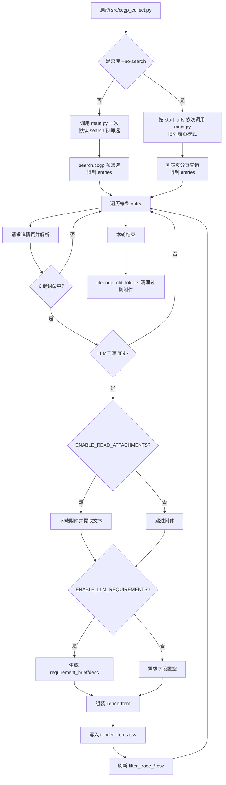

# CCGP 项目流程

## 1. 总览
当前项目在“搜索预筛选 + 详情解析 + 双层筛选 + 结构化落盘”的框架上运行。  
主流程可以概括为：

1. 启动入口（`ccgp_collect.py`）
2. 选择运行模式（默认 search / `--no-search` 回退）
3. 获取公告 `entries`
4. 详情页查询 + 一轮关键词筛选 + 二轮 LLM 筛选
5. 附件文本提取（可选）+ 需求摘要生成（可选）
6. 写入 `tender_items.csv`、写入筛选追踪、日志落盘
7. 运行结束后清理过期附件目录

---

## 2. 主流程图


---

## 3. 入口与模式切换
文件：`src/ccgp_collect.py`

### 3.1 默认模式（推荐）
不传 `--no-search` 时：
- 只调用一次 `main()`
- 直接走 `search.ccgp.gov.cn/bxsearch` 预筛选
- 不再遍历旧的地方/中央两个 `start_urls`

### 3.2 回退模式（旧链路）
传 `--no-search` 时：
- 继续按两个入口 URL 运行：
  - `https://www.ccgp.gov.cn/cggg/dfgg/gkzb/index.htm`
  - `https://www.ccgp.gov.cn/cggg/zygg/gkzb/index.htm`
- 每个入口分别调用一次 `main()`

### 3.3 收尾清理
无论哪种模式，末尾都会执行：
- `cleanup_old_folders(ATTACHMENTS_DIR, CLEAN_THRESHOLD)`
- 删除目录名后缀为 `_YYYYMMDD` 且超阈值天数的附件目录

---

## 4. 候选公告列表的获取（第一层收敛）
文件：`src/ccgp/main.py`、`src/ccgp/parse_index.py`

**解析列表页，返回列表页里收集的候选公告list：**

```python
        out.append(
            {
                "title": title,
                "url": url,
                "pub_raw": meta.get("pub_raw", ""),
                "pub_iso": meta.get("pub_iso", ""),
                "region": meta.get("region", ""),
            }
        )
        ...

        return out
```

## 4.1 默认：search 预筛选
核心函数：`_collect_entries_from_search(...)`

它会按关键词表 `FILTER_KEYWORDS` 遍历，构造 `bxsearch` URL：

```python
params = {
    "searchtype": "2",
    "bidType": "1",
    "dbselect": "bidx",
    "kw": keyword,
    "start_time": start_date,
    "end_time": end_date,
    ...
}
```

### 4.1.1 时间范围
- `start_date = cutoff.date()` （当前日期减去config.py里的DAYS）
- `end_date = now.date()`

### 4.1.2 结果解析
`parse_search_page()` 按真实页面结构解析：
- 主选择器：`ul.vT-srch-result-list-bid > li`
- 每条提取：`title/url/pub_raw/pub_iso/region`
（若 `a.href` 无效（可能由脚本重写），使用页面变量 `ohtmlurls` 兜底恢复 URL）

### 4.1.3 反爬控制与中断策略
当前逻辑中，检索层包含明确的限流和风控处理：
- 每页请求后随机休眠
- 每固定页数增加长休眠
- 每个关键词完成后再休眠
- 若返回“访问过于频繁 / 频繁访问 / 事件ID”：
  - 先冷却
  - 再重试 1 次
  - 仍被拦截则 `stop_all_search=True`，提前终止本轮预筛选

### 4.1.4 去重
- `dedup` 以 `ann_url` 为键去重
- 同一公告被多个关键词命中只保留一次

## 4.2 回退：列表页模式（--no-search）
- `norm_list_page_urls` 生成分页 URL
- `parse_list_page` 解析列表
- 无 search 预筛选

---

## 5. 详情处理与双层筛选（第二层收敛）
文件：`src/ccgp/main.py`、`src/ccgp/parse_detail.py`、`src/ccgp/tools.py`、`src/ccgp/llm_requirements.py`

**遍历上一步得到的候选公告list里的每一个公告，解析其详情页，并根据解析到的内容进行两轮的筛选：1、关键词命中（排除屏蔽词） 2、对通过一轮筛选的公告调用llm进行语义的检查**

对每个候选公告的处理顺序如下：

### 5.1 追踪记录初始化
先写入筛选追踪缓存：
- `title`
- `url`
- `is_selected = None`
- `not_selected_reason = "pending"`

### 5.2 时间过滤
- 仅在 `--no-search` 模式下执行精确时间过滤：

```python
if pub_dt and pub_dt < cutoff and not use_search_prefilter:
    ...
```

> 说明：search 模式已在检索侧做时间范围约束，因此这里不再重复按精确时分秒剔除。

### 5.3 抓详情页并解析
`parse_detail_page` 输出字段：
- `full_text`
- `project_name`
- `budget`
- `deadline`
- `company_name`
- `purchasing_unit_contact_number`
- `contact_name`
- `contact_phone`
- `location_text`
- `attachments`

### 5.4 一轮关键词筛选（规则）
先拼接：
```python
combined = " ".join([
    ent.get("title", ""),
    detail.get("project_name", ""),
    detail.get("full_text", ""),
])
```

再判断：
```python
if not keyword_hit(combined, keywords):
    # round1 keyword filter not matched
```

`keyword_hit` 内部会结合 `FILTER_EXCLUDE_KEYWORDS` 做干扰词剔除。

### 5.5 二轮 LLM 筛选（语义）
调用：`llm_second_filter_by_combined(...)`  
目标：剔除“智能/智慧”等仅为修饰、非项目主体需求的公告。

- 未通过：记录 `round2 llm rejected: ...` 并跳过
- 调用异常：记录 warning，采用“fallback keep”继续

### 5.6 通过筛选后的状态标记
- `is_selected = True`
- `not_selected_reason = ""`

---

## 6. 附件处理与需求生成
文件：`src/ccgp/main.py`、`src/ccgp/tools.py`、`src/ccgp/llm_requirements.py`

### 6.1 附件处理开关
`ENABLE_READ_ATTACHMENTS=True` 时才进入附件循环。

### 6.2 附件循环控制
- 每条公告最多处理 `MAX_ATTACHMENTS_PER_NOTICE`
- 先做黑名单和失败去重：
  - `_should_skip_attachment(a_url, a_name)`
  - `SKIP_REPEATED_FAILED_ATTACHMENTS`

### 6.3 附件下载与抽取
`download_file + extract_text_from_file` 支持：
- PDF
- DOCX
- XLSX
- TXT
- ZIP

提取成功的文本汇总到 `att_texts`，供后续需求生成使用。

### 6.4 需求生成开关
`ENABLE_LLM_REQUIREMENTS=True` 时调用 `generate_requirements`。

输出字段：
- `requirement_brief`
- `requirement_desc`

---

## 7. 结果落盘与可追踪性

### 7.1 业务结果
写入：`src/ccgp/data/tender_items.csv`

对象：`TenderItem`，包含公告基础信息、预算、联系人、需求摘要等字段。

### 7.2 筛选追踪
写入：`src/ccgp/data/filter_trace/filter_trace_YYYYMMDD_HHMMSS.csv`

字段固定为：
- `title`
- `url`
- `is_selected`
- `not_selected_reason`

典型 `not_selected_reason`：
- `older than DAYS window`
- `detail fetch failed: ...`
- `round1 keyword filter not matched`
- `round2 llm rejected: ...`

### 7.3 运行日志
写入：`src/ccgp/data/logs/app_YYYYMMDD_HHMMSS.log`

---

## 8. GitHub Actions 对应关系
文件：`.github/workflows/weekly.yml`

- 调度时间：每天北京时间 00:00（UTC 16:00）
- 运行命令：`python src/ccgp_collect.py --days 1`
- 上传 Artifact：
  - `src/ccgp/data/logs/`
  - `src/ccgp/data/filter_trace/`
- 自动提交：`src/ccgp/data/tender_items.csv`（有变更时）


